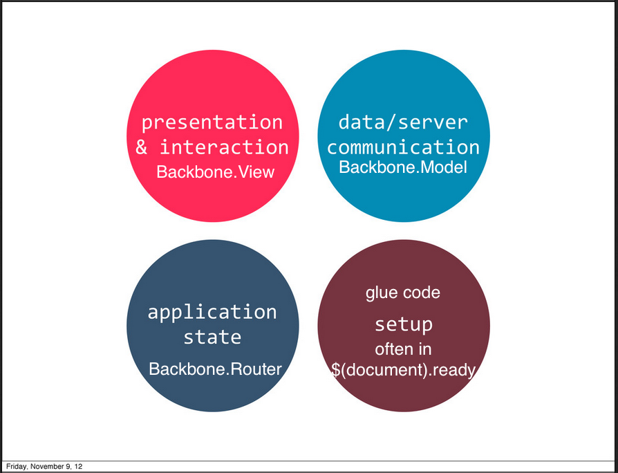

# 10/01/2014
# Dreyfus Model of Skill Acquisition

## Novice
- Primarily characterized by their struggle with encountering failures and successes in the face of problems.
- not sure how to respond to mistakes
- frustrated and confused when things go wrong
- the way they learn and advance is through recipes (i.e. When X, do Y)

## Advanced Beginner
- Wants information, not theory, but also not basics.

## Competent
- Begin to form independent mental models
- Troubleshoot novel problems

# Backbone
Gives you constructors to avoid boilerplate and duplicated code, and to give a loose organization to your application.

## Backbone.View
Handles presentation and interaction.

A view is an object that represents an HTML element. That element may or may not be in the DOM.

## Model
Handles data and server synchronization.

E.g. If a name is stored on the server as "Jake Smith", I might want to have that appear in my page as First Name: "Jake", Last Name: "Smith". That logic belongs in a model.

```js
Backbone.Model; // constructor / function
new Backbone.Model(); // instance of the Model constructor
Backbone.Model.extend(); // a function that returns a constructor, that constructor is extended with the properties and methods you pass to extend.

var Todo = Backbone.Model.extend({});
```

NEVER type "**new** Backbone.Model.extend..."

When you construct an instance, you pass properties in via an object that are saved onto the internal `attributes`. The exception to this is `id`, which has special meaning for a model.

# Backbone architecture

