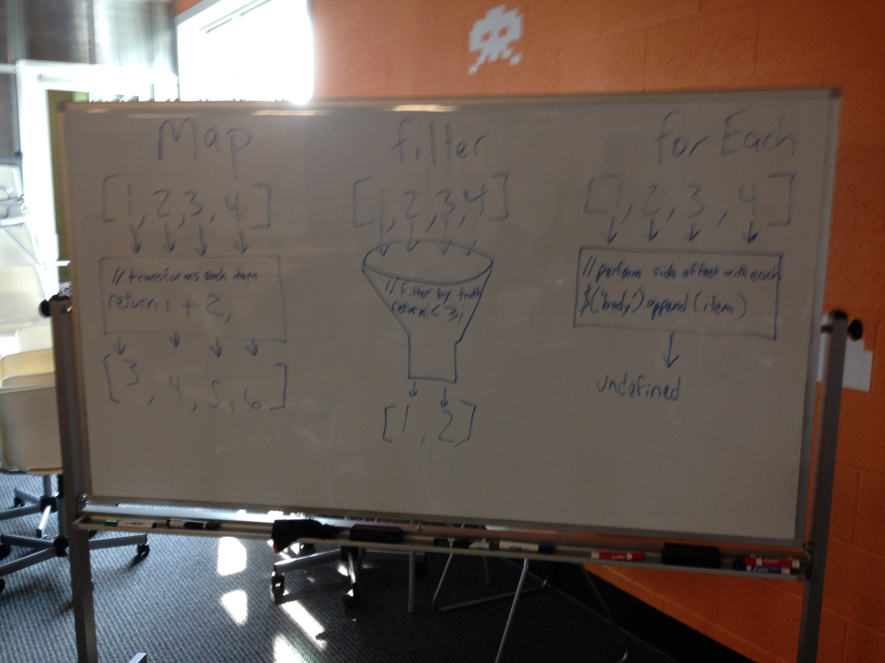
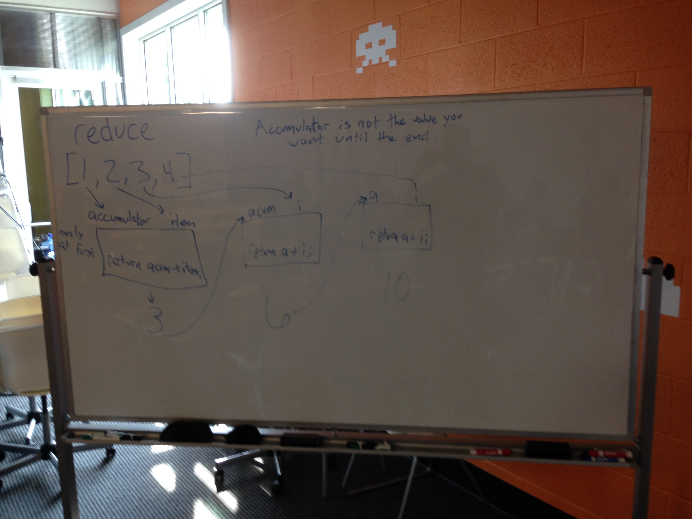

# AJAX / Ajax
Asynchronous JavaScript and XML

One of the first examples was Gmail.

# Cross Domain Requests
Browsers put limits on the ability to make cross domain requests.

## Cross Origin Resource Sharing
CORS -> Access-Control-Allow-Origin

# Getting JSON from a URL

```javascript
$.getJSON(url).done(function(data){
  // Use data here
});
```

# JSBin
- http://jsbin.com/nimedu/1/edit
- [Crappy template function](http://jsbin.com/yiluye/1/edit)

# Iteration




# GitHub API Access

1. Create a Personal access token (https://github.com/settings/applications)
2. Give it a description like "GitHub Homework"
3. Select the `public_repo` and `user` scopes.
4. Click Generate token and copy the token
5. Create a file called `token.js` with contents:

    ```js
    var token = <Your actual token goes here>;

    $.ajaxSetup({
      headers: {
        "Authorization": "token " + token
      }
    });
    ```

6. Create a `.gitignore` file to ignore the token file:
    ```
    token.js
    ```

7. Include token.js in a script tag before your script.
