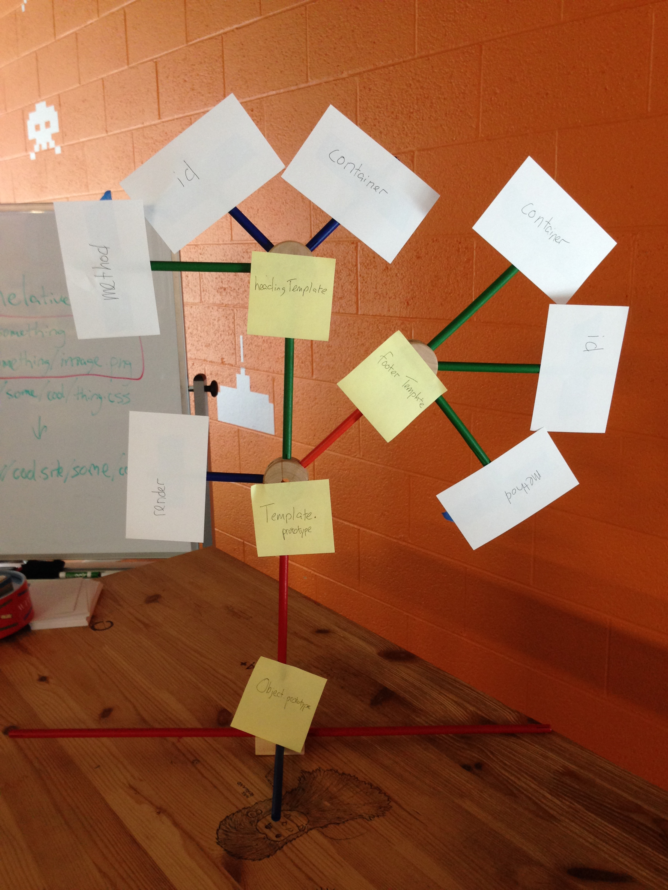

# 09/23/14

## JS Review
http://jsbin.com/wagura/1/edit

## Strict Mode (`'use strict';`)
- http://jsbin.com/wexiqo/3/edit
- https://developer.mozilla.org/en-US/docs/Web/JavaScript/Reference/Strict_mode

- Prevents implicit global variable creation
- Throws an error when you delete an undeletable property
- Throws an error when you have duplicate properties in an object literal
- Throws an error when you try to delete a "bare word", i.e. `delete someVariable;`
- Throws an error when you try to declare a variable with the name `arguments`;
- Doesn't alias `arguments` to parameters.
- Makes the default value of `this` be `undefined`.

## Prototypes and Constructors
http://jsbin.com/kijexe/1/edit

## Using constructors IRL
http://jsbin.com/xomizo/1/edit

## Prototype Chain

